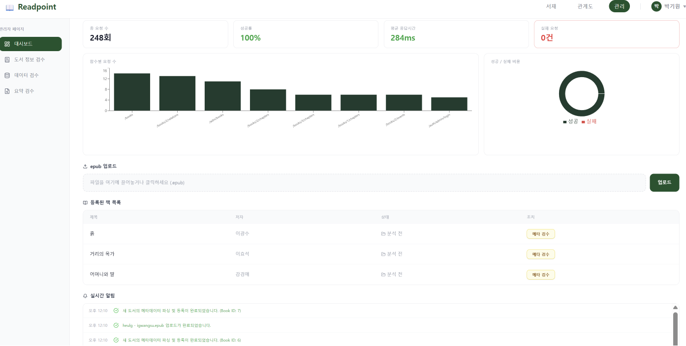
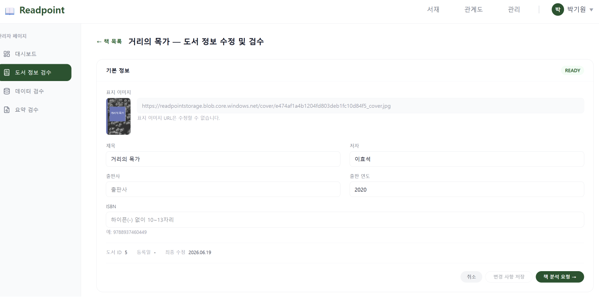
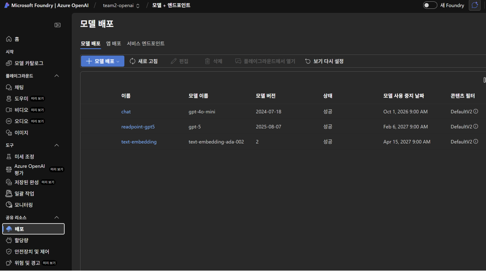
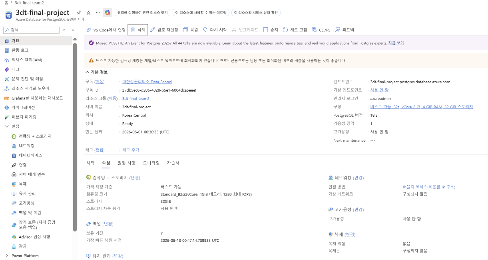
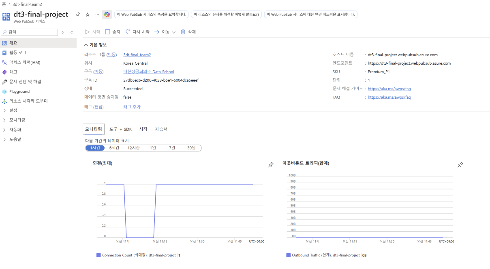
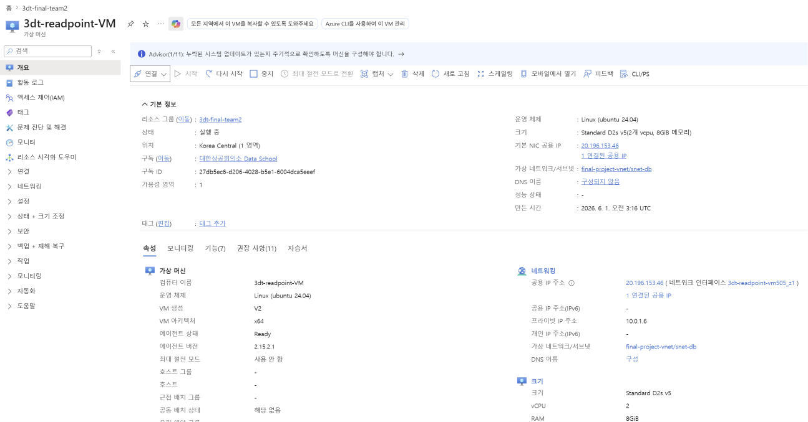
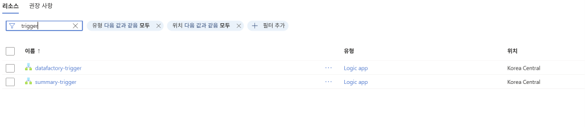
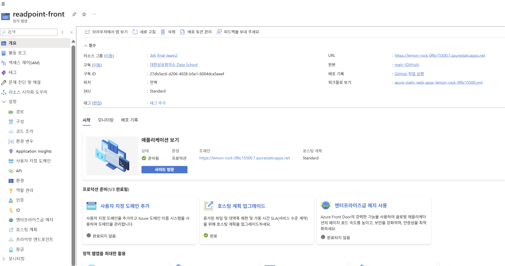
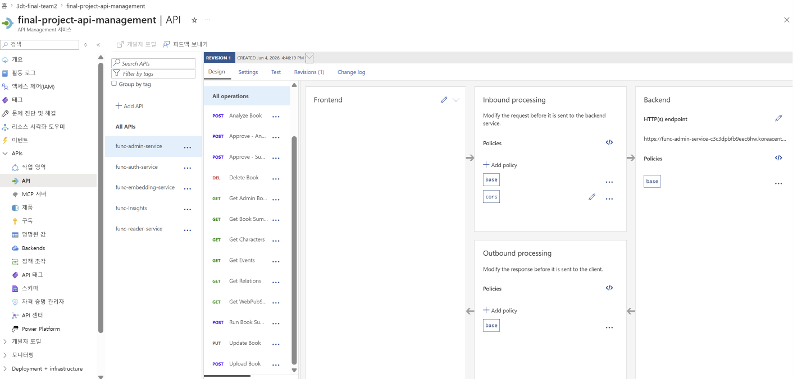

# Readpoint — Book Relationship Visualization Service

> 스포일러 없이 책을 읽고, 등장인물 관계를 시각화하는 RAG 기반 독서 서비스

## 📌 프로젝트 개요

| 항목 | 내용 |
|------|------|
| 개발 기간 | 2025.12 ~ 2026.06 |
| 팀 구성 | 5인 (프론트엔드 1, 백엔드 2, 데이터 2) |
| 담당 역할 | 프론트엔드 개발, Admin 대시보드, API 연동 |
| 주관 기관 | 대한상공회의소 K디지털트레이닝 Microsoft Data School |
| 배포 URL | https://lemon-rock-0f6c15500.7.azurestaticapps.net |

## 🎯 핵심 기능

- **스포일러 방지**: 현재 읽은 챕터 범위 내에서만 AI가 답변
- **인물 관계도**: 사건별로 동적 업데이트되는 등장인물 관계 그래프
- **AI 독서 메이트**: 읽은 범위 내에서만 답변하는 RAG 기반 토론 파트너
- **진도 동기화**: 마지막 읽은 위치 자동 저장 및 이어읽기

## 🏗️ 전체 아키텍처

## 🗂️ 데이터 파이프라인

### 1차 파이프라인 — 캐릭터 추출 및 관계 분석

`chapter_split` → `get_chapters` → ForEach `openai_extract` → `normalize_characters` → `book_graph_refine`

### 2차 파이프라인 — 독서 진행 요약 생성

`migrate_graph_endpoint` → `get_progress_events` → ForEach `generate_progress_summary`

### 파이프라인 성공 실행 (Gantt)

## 🖥️ 서비스 화면

### 랜딩 페이지

### 로그인

### 서재

### EPUB 뷰어

### 인물 관계도

### AI 독서 메이트

### Admin 대시보드

### Admin 도서 정보 검수

## ☁️ Azure 인프라

### Azure OpenAI 모델 배포

| 배포명 | 모델 | 용도 |
|--------|------|------|
| readpoint-gpt5 | gpt-5 | 캐릭터 추출 및 관계 분석 |
| chat | gpt-4o-mini | AI 독서 메이트 RAG |
| text-embedding | text-embedding-ada-002 | 벡터 임베딩 |

### PostgreSQL Flexible Server

### Azure Web PubSub (실시간 알림)

### Azure VM — Neo4j 호스팅

### Logic App — 파이프라인 트리거

### Azure Static Web Apps

### Azure APIM

## 🔧 트러블슈팅

### Content Filter 오류 대응

Azure OpenAI Content Management Policy로 인해 `violence: filtered: true` 오류 발생 → FILTERED 상태 분리 처리로 해결

### Too Many Requests 처리

ForEach Batch Count 20 → 1 → 3 순차 조정으로 Rate Limit 해소

### Managed VNet Private Endpoint 구성

ADF에서 PostgreSQL 접근 시 퍼블릭 IP 차단 이슈 → Managed VNet + Private Endpoint 구성으로 해결

## 📁 레포지토리 구성

| 레포 | 설명 |
|------|------|
| [readpoint-frontend](https://github.com/3dt-3rd-project-org/readpoint-frontend) | React 기반 프론트엔드 |
| [admin-service](https://github.com/3dt-3rd-project-org/admin-service) | 관리자 대시보드 |
| [insight-service](https://github.com/3dt-3rd-project-org/insight-service) | Application Insights 모니터링 |
| [reader-service](https://github.com/3dt-3rd-project-org/reader-service) | 도서 조회 서비스 |
| [auth-service](https://github.com/3dt-3rd-project-org/auth-service) | 인증 서비스 |
| [embedding-service](https://github.com/3dt-3rd-project-org/embedding-service) | RAG 임베딩 서비스 |
| [function](https://github.com/3dt-3rd-project-org/function) | Azure Functions 파이프라인 |
| [neo4j-data-pipeline](https://github.com/3dt-3rd-project-org/neo4j-data-pipeline) | Neo4j 그래프 DB 파이프라인 |

## 🛠️ 기술 스택

| 분류 | 기술 |
|------|------|
| Frontend | React, Azure Static Web Apps |
| Backend | Azure Functions, Azure APIM |
| AI | GPT-5, GPT-4o-mini, text-embedding-ada-002 |
| Data | Azure ADF, pgvector, Neo4j, Logic Apps |
| Realtime | Azure Web PubSub |
| Monitoring | Azure Application Insights |
| Infra | Azure VM (Ubuntu 24.04), Docker, Managed VNet |

## 👤 담당 작업

- Google OAuth 리다이렉트 기반 인증 흐름 구현
- Admin 대시보드 실제 API 연동 및 Application Insights 모니터링 화면 구현
- WebSocket 기반 실시간 알림 연동 (Azure Web PubSub)
- 인물 관계 그래프 뷰어 구현 (Graph.jsx)
- Azure Static Web Apps CI/CD 배포 이슈 해결 (PHP 오탐, JWT_SECRET 누락)
- insight-service, admin-service API 직접 구현
