[🇰🇷 한국어](./README.md) | [🇺🇸 English](./README_EN.md)

# Readpoint — Book Relationship Visualization Service

> A RAG-based reading service that visualizes character relationships without spoilers

## 📌 Project Overview

Readpoint is an AI reading service that allows users to explore character relationships without spoilers while reading EPUB-based e-books. The character relationship graph dynamically updates based on the user's current reading progress, and the RAG-based AI reading companion answers questions strictly within the read range. Administrators can upload an EPUB and the Azure ADF pipeline automatically handles character extraction, relationship analysis, and graph construction.

**Full Pipeline Flow:**
```
[Metadata Parsing]
metadata_parser (EPUB upload → metadata extraction)
↓
[Pipeline 1 — Character Extraction & Relationship Analysis]
chapter_split → openai_extract → normalize_characters → save_normalized_analysis → book_graph_refine
↓
[Pipeline 2 — Summary Generation]
migrate_graph → generate_progress_summary
```

## 🎯 Key Features

- **Spoiler Prevention**: AI responds only within the user's current chapter range
- **Character Graph**: Dynamically updated character relationship graph per event
- **AI Reading Companion**: RAG-based discussion partner scoped to read content
- **Progress Sync**: Automatically saves and restores last reading position

## 🏗️ System Architecture

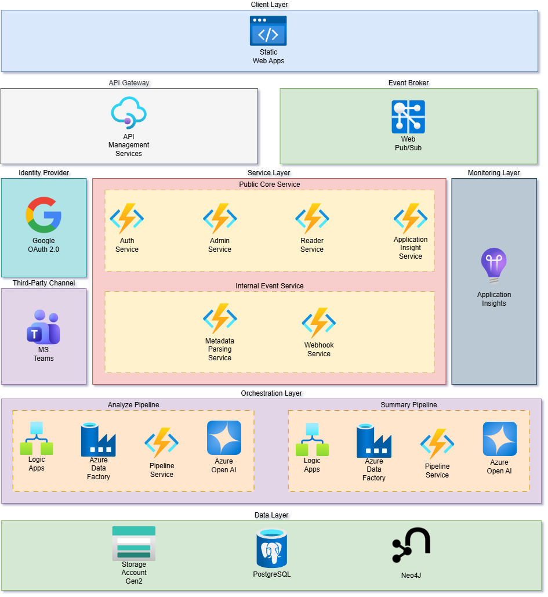

## 🗂️ Data Pipeline

### Pipeline 1 — Character Extraction & Relationship Analysis
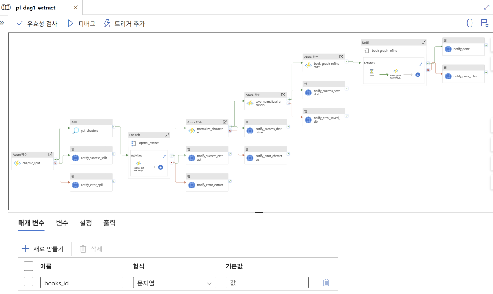

`chapter_split` → `get_chapters` → ForEach `openai_extract` → `normalize_characters` → `save_normalized_analysis` → `book_graph_refine`

### Pipeline 2 — Reading Progress Summary Generation
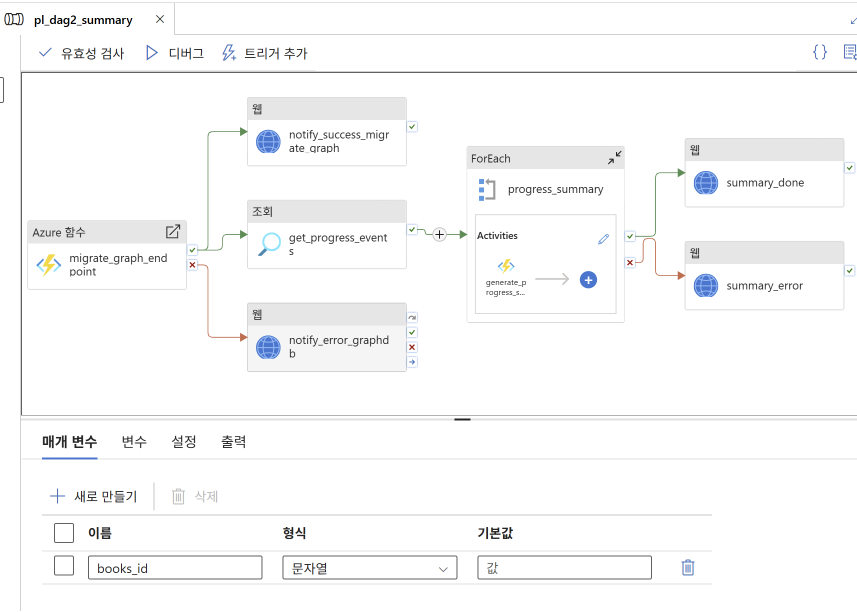

`migrate_graph_endpoint` → `get_progress_events` → ForEach `generate_progress_summary`

#### Pipeline Performance (Final: ForEach Batch Count 3)

| Title | Chapters | Paragraphs | Duration | Cost |
|---|---|---|---|---|
| 어머니와 딸 | 6 | 1,861 | 11m 29s | ~₩1,300 |
| 선화공주 | 5 | 744 | 8m 58s | ~₩800 |
| 순정해협 | 7 | 1,708 | 9m 51s | ~₩1,400 |
| 거리의 목가 | 12 | 663 | 11m 45s | ~₩1,900 |
| 꿈 | 22 | 947 | 20m 11s | ~₩3,600 |
| 흙 | 5 | 6,304 | 8m 10s | ~₩1,500 |

### Pipeline Success Run (Gantt)
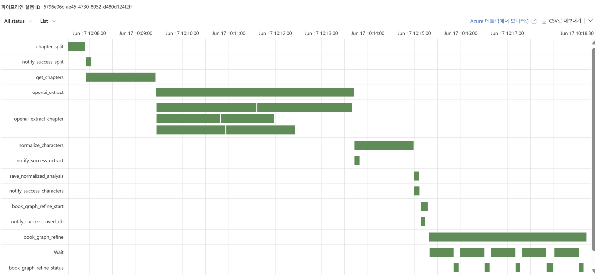

## 🗄️ Database ERD

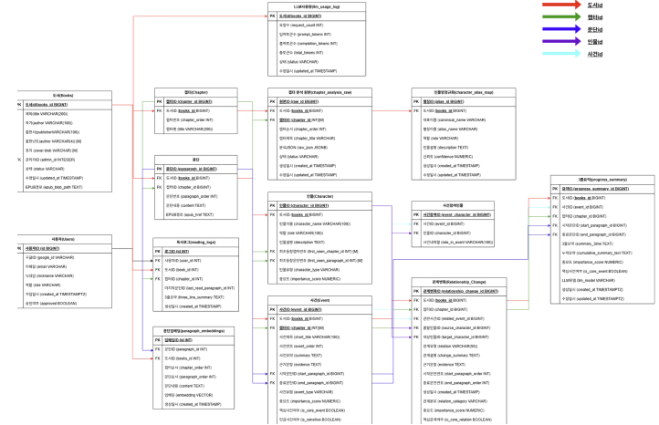

## 🖥️ Service Screens

### Landing Page
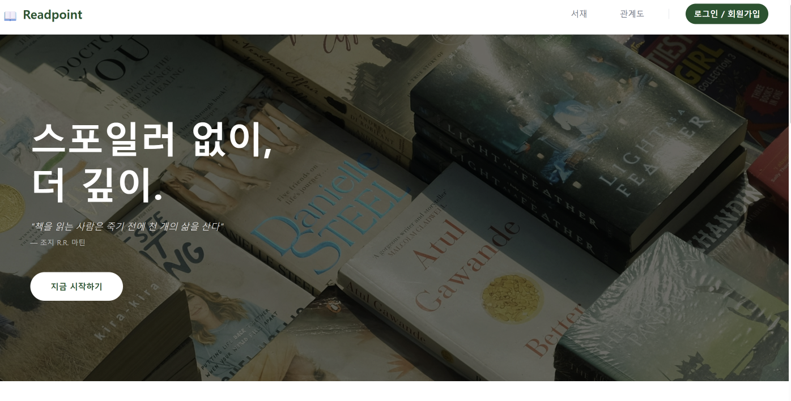
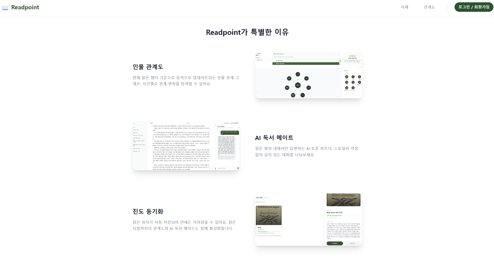

### Login
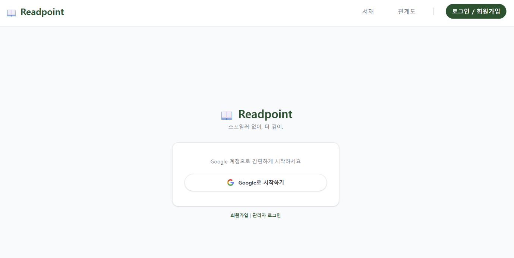

### Library
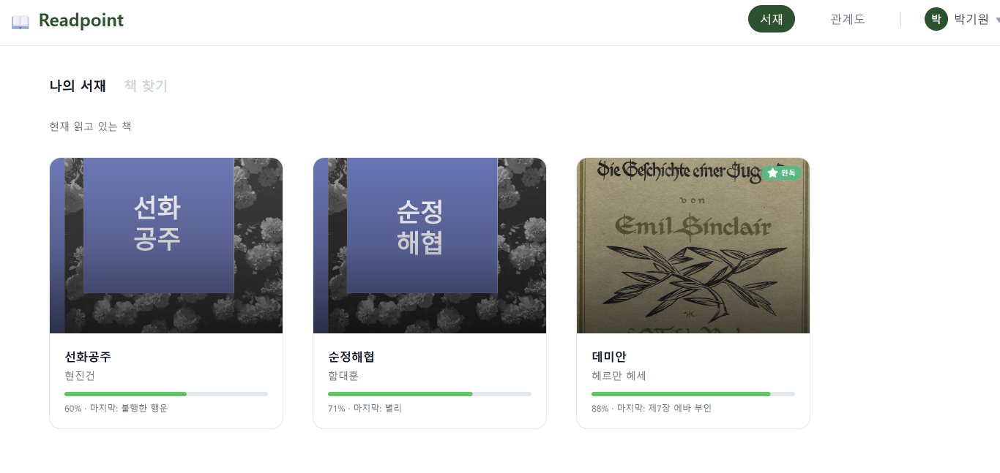

### EPUB Viewer
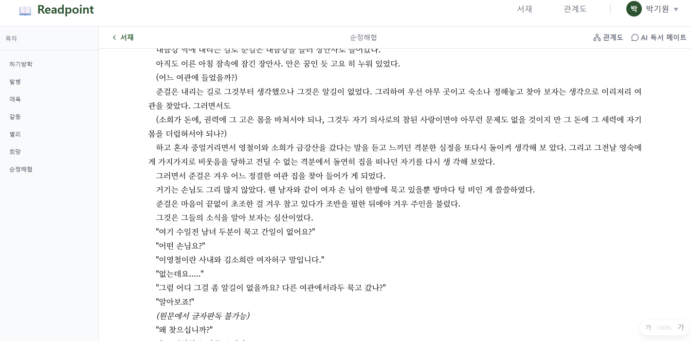

### Character Graph
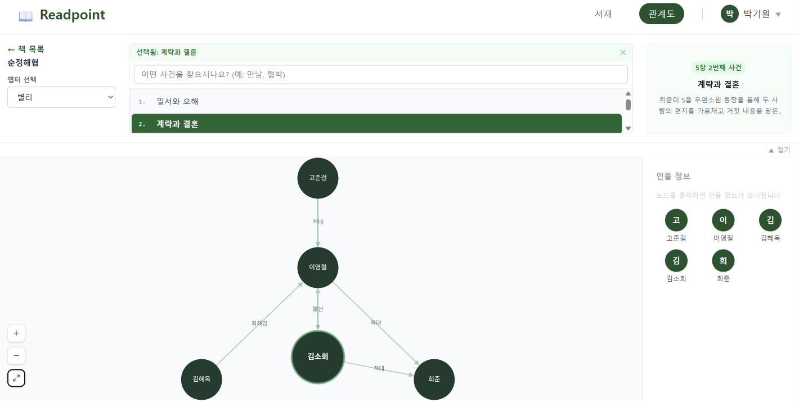

### AI Reading Companion
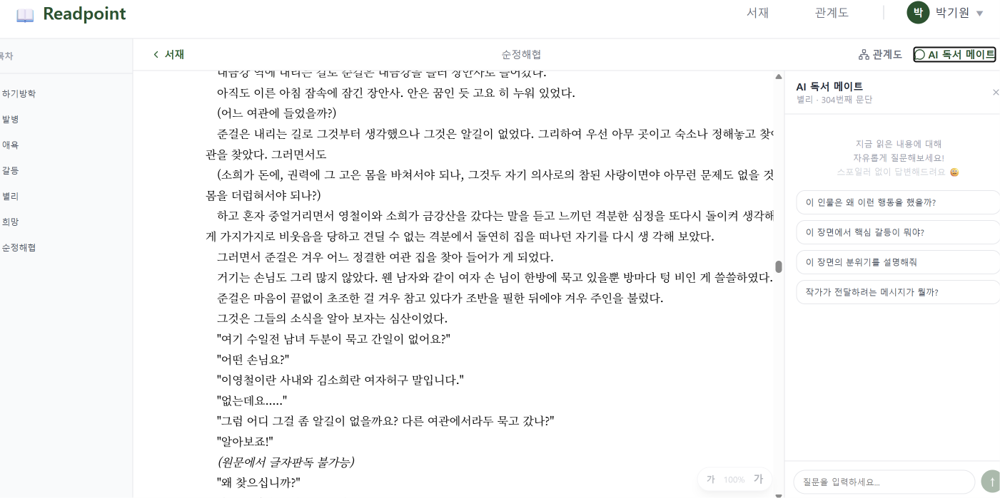

### Admin Flow (Video)


## 🔧 Troubleshooting

### Content Filter Error Handling
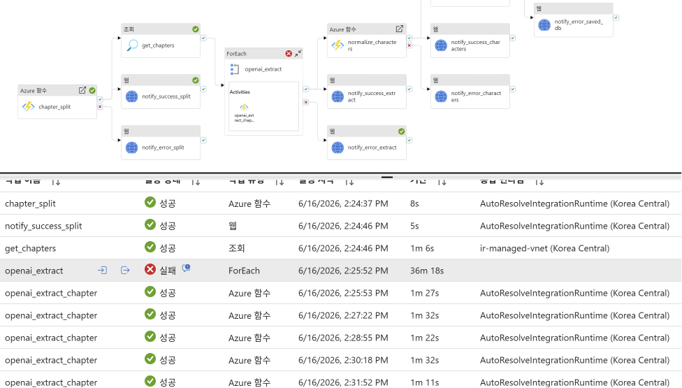
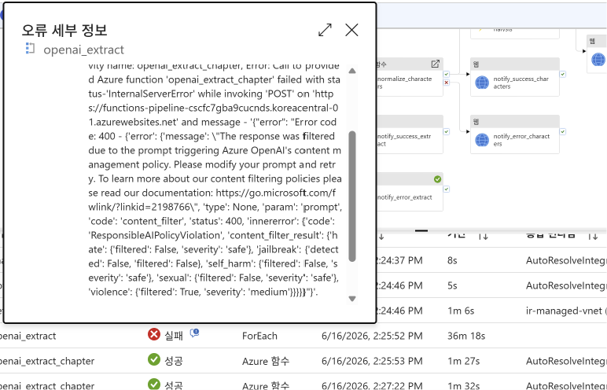

Azure OpenAI Content Management Policy triggered `violence: filtered: true` errors → resolved by separating `FILTERED` state to allow pipeline continuation

### Too Many Requests Handling
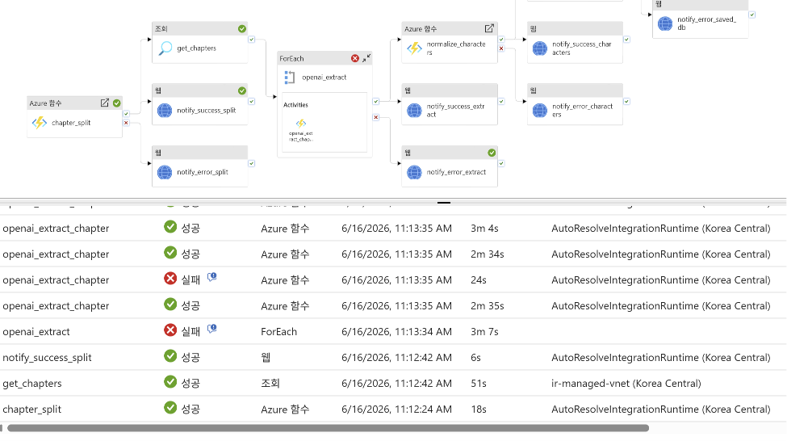
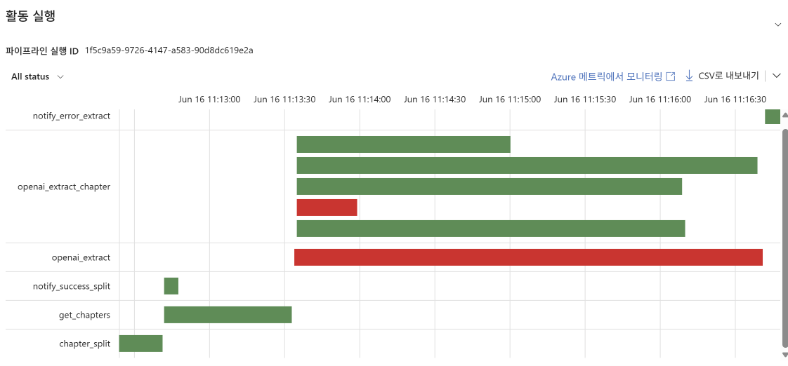

ForEach Batch Count tuned 20 → 1 → 3 to resolve GPT rate-limit failures → **0 failures across 6 books, processing time 15 min → 9 min**

### Managed VNet Private Endpoint Setup
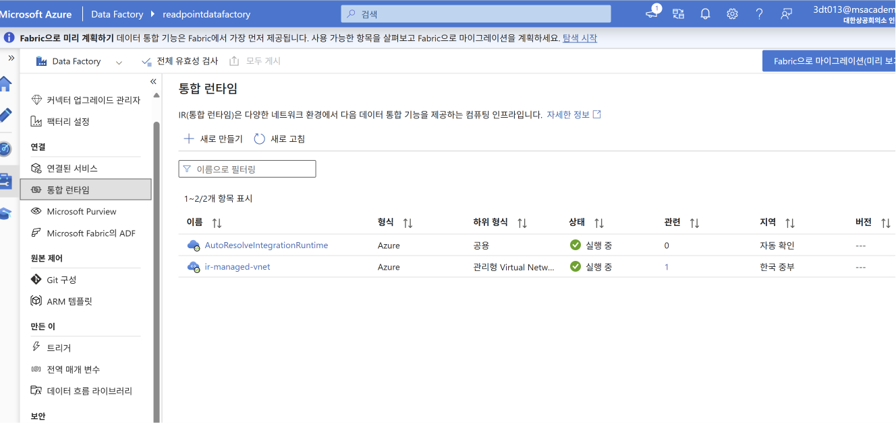
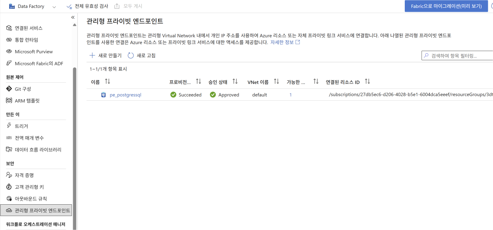

ADF blocked from accessing PostgreSQL over public IP → configured Managed VNet + Private Endpoint for secure private connectivity

## 🔄 Airflow DAG Migration (Personal Practice)

Redesigned ADF pipeline as Apache Airflow DAGs after project completion.

- **Environment**: Docker + Airflow 2.10.5 (local)
- **DAG**: `dags/readpoint_dag.py`
- **Key changes**:
  - ADF ForEach → Python for-loop
  - XCom for task-to-task `books_id` passing
  - Selective task retry on failure
- **Repo**: [readpoint-airflow](https://github.com/bagg8234-lab/readpoint-airflow)
- **Velog series**: [Why I Moved from ADF to Airflow](https://velog.io/@rldnjs0906/series/Azure-Data-Factory-%EC%93%B0%EA%B3%A0-Airflow%EB%A1%9C-%EB%84%98%EC%96%B4%EA%B0%84-%EC%9D%B4%EC%9C%A0)

## 📁 Repository Structure

| Repo | Description |
|---|---|
| [metadatafunction](https://github.com/3dt-3rd-project-org/metadatafunction) | EPUB metadata parsing function |
| [insight-service](https://github.com/3dt-3rd-project-org/insight-service) | Application Insights monitoring API |
| [reader-service](https://github.com/3dt-3rd-project-org/reader-service) | Book retrieval service |
| [auth-service](https://github.com/3dt-3rd-project-org/auth-service) | Authentication service |
| [embedding-service](https://github.com/3dt-3rd-project-org/embedding-service) | RAG embedding service |
| [admin-service](https://github.com/3dt-3rd-project-org/admin-service) | Admin dashboard |
| [webhook-service](https://github.com/3dt-3rd-project-org/webhook-service) | Webhook service |
| [function](https://github.com/3dt-3rd-project-org/function) | Azure Functions pipeline |
| [neo4j-data-pipeline](https://github.com/3dt-3rd-project-org/neo4j-data-pipeline) | Neo4j graph DB pipeline |
| [readpoint-frontend](https://github.com/3dt-3rd-project-org/readpoint-frontend) | React frontend |
| [readpoint-airflow](https://github.com/bagg8234-lab/readpoint-airflow) | Airflow DAG migration (personal) |

## 🛠️ Tech Stack

| Category | Technologies |
|---|---|
| Frontend | React, Azure Static Web Apps |
| Backend | Azure Functions, Azure APIM |
| AI | GPT-5, GPT-4o-mini, text-embedding-ada-002 |
| Data | Azure ADF, pgvector, Neo4j, Logic Apps |
| Realtime | Azure Web PubSub |
| Monitoring | Azure Application Insights |
| Infra | Azure VM (Ubuntu 24.04), Docker, Managed VNet |
| Orchestration | Azure ADF, Apache Airflow |

## 👤 My Contributions

- Full React frontend development (landing, library, viewer, character graph, AI reading companion)
- Admin dashboard API integration and book status pipeline UI
- Application Insights monitoring API and real-time dashboard
- AI reading companion development (query rewriting, spoiler filtering via pgvector)
- ADF pipeline participation (character extraction & normalization)
- ADF → Airflow DAG redesign (Docker local environment, XCom, ForEach)
